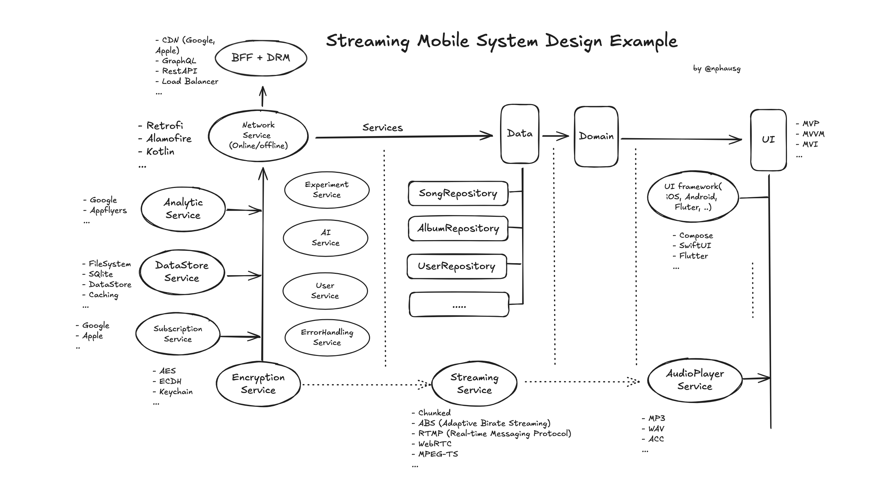

<h1 align="center"> :robot: Android Streaming  with Chunked Demo </h1>

<div align="center">
    
    
    
    
    
    <a href="https://github.com/nphau/android.embeddedserver/actions/workflows/app-build.yml"></a>
</div>


## 👉 Overview
A mobile streaming audio service like Spotify needs to deliver a seamless user experience with features such as real-time streaming, offline playback, personalized recommendations, and more. This involves designing both the client-side (mobile app) and server-side components of the system.

In this example, we'll use Ktor to serve a audio/ video file using chunked streaming. This approach allows the client to start playing the video while the remaining parts are still being downloaded.

### Key Components

#### Client-Side (Mobile App)

1. User Interface (UI)
- Home Screen: Displays personalized recommendations, playlists, and trending tracks.
- Search: Allows users to find songs, albums, artists, and playlists.
- Player: Controls playback with features like play, pause, skip, and volume adjustment.
- Library: Shows saved playlists, favorite tracks, and offline content.

2. Audio Streaming
- Audio Player: Handles playback, buffering, and caching. Supports various audio formats (e.g., MP3, AAC).
- Streaming Protocols: Uses HTTP Live Streaming (HLS) or DASH for adaptive streaming.
- Offline Mode: Allows users to download and cache audio files for offline listening.

3. User Management

- Authentication: Handles user sign-up, login, and session management.
- Personalization: Provides recommendations based on user preferences and listening history.
- Settings: Manages user preferences, including audio quality and notifications.

4. Networking
- API Integration: Communicates with backend services for user data, playlists, and streaming content.
- Error Handling: Manages network errors and retries, ensuring smooth playback.

### Server-Side (Backend)
1. Content Delivery Network (CDN)
- Streaming Servers: Distributes audio content efficiently to reduce latency and improve playback quality.
- Caching: Stores frequently accessed content closer to users to reduce load times.

2. Media Storage
- Audio Storage: Stores audio files in a scalable and redundant storage system (e.g., cloud storage like Amazon S3).
- Metadata Storage: Manages metadata for songs, albums, and playlists in a database.
3. Streaming Services

4. User Management
- Authentication Service: Manages user accounts, including login, registration, and session handling.
- Authorization: Handles user permissions and subscription levels (e.g., free vs. premium).

5. Recommendation Engine
- Algorithms: Uses machine learning algorithms to provide personalized recommendations based on listening history and user behavior.
- Data Processing: Analyzes user data and interactions to improve recommendation accuracy.

6. Analytics
- Tracking: Collects data on user interactions, playback statistics, and system performance.
- Reporting: Provides insights into user behavior, content popularity, and system health.

7. Scalability and Reliability
- Load Balancing: Distributes incoming requests across multiple servers to manage traffic and ensure high availability.
- Redundancy: Ensures that there is no single point of failure by using replicated databases and failover mechanisms.
- Auto-Scaling: Adjusts resources dynamically based on traffic and load.

### Mobile System Design Diagram



### Security Considerations
- Encryption: Encrypt audio streams and data in transit using HTTPS/TLS to protect user privacy.
- Authentication: Implement OAuth2 or similar authentication mechaniss for secure user access.
- Access Control: Ensure that only authorized users can access premium content and features.

### Performance and Optimization
- Caching: Use caching strategies at both the CDN and application levels to reduce latency and load times.
- Compression: Compress audio files and data transfers to minimize bandwidth usage.
- Monitoring: Continously monitor system performance and user interactions to identify and address potential issues.

## 🚀 How to use

Cloning the repository into a local directory and checkout the desired branch:

```
git@github.com:nphausg/android.streaming.chunked.git
cd android.streaming.chunked
git checkout master
```

## ✨ Contributing

Please feel free to contact me or make a pull request.

## 👀 Author

<p>
    <a href="https://nphausg.medium.com" target="_blank">
    
    </a>
    
</p>
